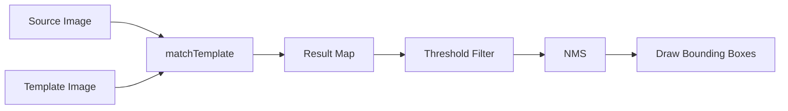

# Template Matching

> **جاهز للتطبيق** — نظام مطابقة القوالب (Template Matching) باستخدام OpenCV.  
> ابحث عن صورة قالب داخل صورة مصدرية مع دعم تغيير الحجم (Multi-Scale) وواجهة مستخدم رسومية.

---

## 🚀 الميزات | Features

| الميزة | الوصف |
|--------|-------|
| **6 طرق مطابقة** | CCOEFF, CCORR, SQDIFF (كل منها normalized) |
| **Multi-Scale** | البحث عن القالب بأحجام مختلفة (0.3x - 2.5x) |
| **Non-Maximum Suppression** | إزالة الاكتشافات المكررة تلقائياً |
| **🌐 واجهة ويب** | واجهة ويب تفاعلية كاملة (Flask) |
| **GUI كاملة** | واجهة رسومية تفاعلية بـ Tkinter |
| **CLI** | تشغيل من سطر الأوامر |
| **مقارنة الطرق** | عرض جميع طرق المطابقة الستة في صورة واحدة |

---

## 📦 التثبيت | Installation

```bash
pip install -r requirements.txt
```

---

## 🖥️ الاستخدام | Usage

### الواجهة الرسومية (GUI)

```bash
python main.py gui
```

1. اضغط **Load Source** لتحميل الصورة المصدرية
2. اضغط **Load Template** لتحميل صورة القالب (أو استخدم **Crop Template from Source** لقص القالب من الصورة المصدرية مباشرة)
3. اختر طريقة المطابقة والعتبة (Threshold)
4. فعّل **Multi-Scale** إذا كان القالب بحجم مختلف
5. اضغط **RUN MATCHING**

### واجهة الويب (Web)

```bash
python main.py web
```

يفتح المتصفح على `http://127.0.0.1:5000` بواجهة ويب عصرية:
- سحب وإفلات الصور مباشرة
- قص القالب من الصورة المصدرية
- ضبط العتبة وطريقة المطابقة
- تفعيل المطابقة متعددة المقاييس
- عرض النتائج مباشرة
- تحميل صورة النتيجة

### سطر الأوامر (CLI)

```bash
# مطابقة بسيطة
python main.py match source.jpg template.png --threshold 0.75

# مطابقة متعددة المقاييس
python main.py match source.jpg template.png --multi-scale --scale-range 0.5 2.0

# مقارنة جميع الطرق
python main.py compare source.jpg template.png --output comparison.png
```

---

## 📁 هيكل المشروع | Project Structure

```
Template-Matching-/
├── main.py                        # المدخل الرئيسي (GUI & CLI & Web)
├── wsgi.py                        # مدخل WSGI لـ Gunicorn / Render
├── requirements.txt               # المكتبات المطلوبة
├── render.yaml                    # إعدادات النشر على Render
├── runtime.txt                    # إصدار Python للسيرفر
├── src/
│   ├── __init__.py                # الحزمة
│   ├── template_matcher.py        # محرك المطابقة الأساسي
│   ├── multi_scale_matcher.py     # مطابقة متعددة المقاييس
│   ├── web_app.py                 # تطبيق واجهة الويب (Flask API)
│   ├── templates/
│   │   └── index.html             # واجهة المستخدم
│   ├── gui_app.py                 # تطبيق الواجهة الرسومية
│   └── utils.py                   # أدوات مساعدة
├── generate_test_images.py        # مولد صور تجريبية
└── examples/                      # صور تجريبية
```

---

## ⚙️ طرق المطابقة | Matching Methods

| الطريقة | الوصف | الأفضل لـ |
|---------|-------|----------|
| TM_CCOEFF_NORMED | معامل ارتباط منسّق | **موصى به** — أداء ممتاز مع تغيرات الإضاءة |
| TM_CCORR_NORMED | ارتباط متقاطع منسّق | جيد للصور ذات التباين العالي |
| TM_SQDIFF_NORMED | فرق المربعات المنّسق | مفيد عند تطابق الألوان تماماً |

---

## 🧠 كيفية العمل | How It Works



1. يتم تحويل الصور إلى تدرج الرمادي
2. `cv2.matchTemplate()` يحسب خريطة التطابق
3. يتم تصفية النتائج حسب العتبة (Threshold)
4. Non-Maximum Suppression يزيل الاكتشافات المتداخلة
5. يتم رسم المربعات حول المناطق المكتشفة

---

## 📝 المتطلبات | Requirements

- Python 3.8+
- OpenCV 4.8+
- NumPy
- Matplotlib
- Pillow (للواجهة الرسومية)
- Flask (لواجهة الويب)
- Gunicorn (للنشر على السيرفر)

---

## 🌐 النشر على Render | Deploy to Render

### طريقة تلقائية (Render Blueprint)

1. ارفع المشروع إلى GitHub:
   ```bash
   git add .
   git commit -m "Ready for Render deployment"
   git push origin main
   ```

2. اذهب إلى [Render Dashboard](https://dashboard.render.com) ← **New** ← **Web Service**

3. اختر **"Build and deploy from a Git repository"** واربط مستودع GitHub

4. Render سيقرأ ملف `render.yaml` تلقائياً ويضبط:
   - **Runtime**: Python 3.11
   - **Build Command**: `pip install -r requirements.txt`
   - **Start Command**: `gunicorn wsgi:app --bind 0.0.0.0:$PORT --timeout 120 --workers 1 --threads 2`

5. اختر **الخطة المجانية (Free)** ثم اضغط **Create Web Service**

### طريقة يدوية

إذا لم تستخدم `render.yaml`، اضبط الحقول يدوياً عند إنشاء Web Service:
| الحقل | القيمة |
|-------|--------|
| Runtime | Python 3 |
| Build Command | `pip install -r requirements.txt` |
| Start Command | `gunicorn wsgi:app --bind 0.0.0.0:$PORT --timeout 120` |
| Plan | Free |

> ⚠️ **ملاحظة**: الخطة المجانية على Render تتوقف بعد 15 دقيقة من عدم الاستخدام وتستأنف تلقائياً عند أول طلب (قد يستغرق 30-60 ثانية).
